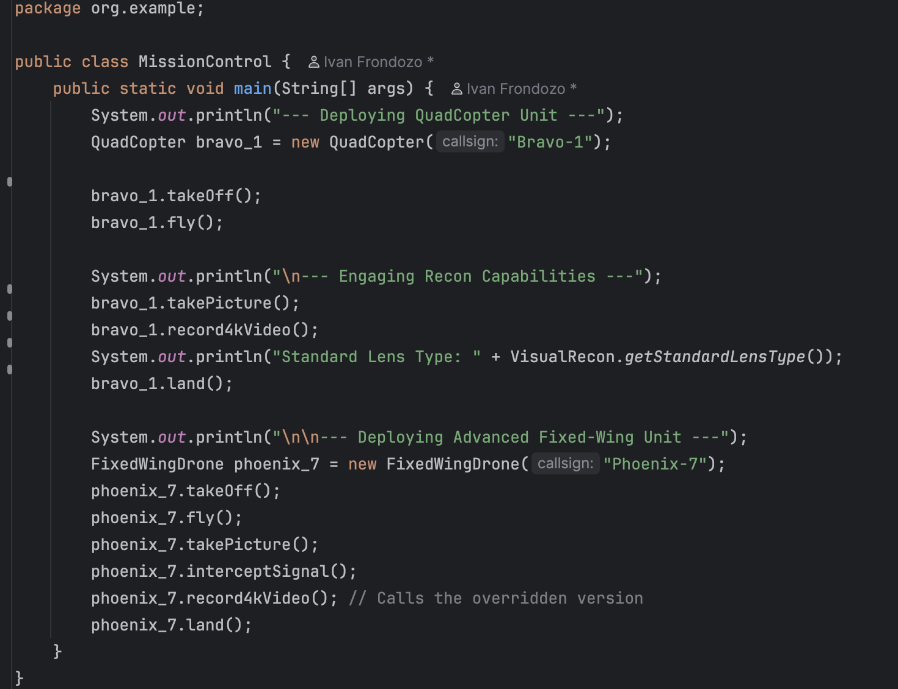
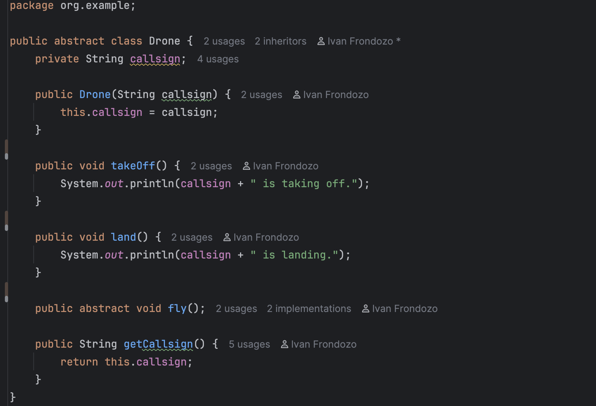
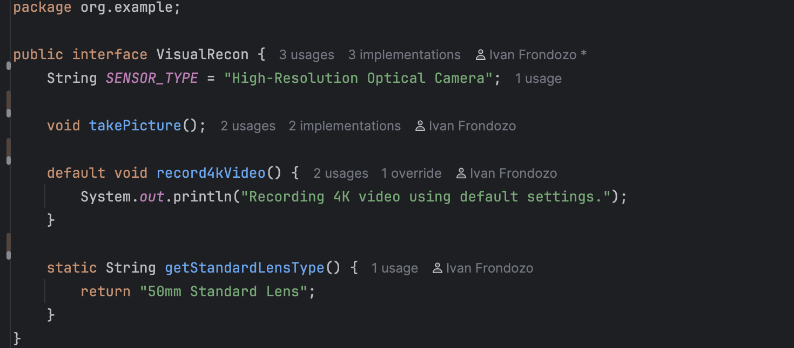
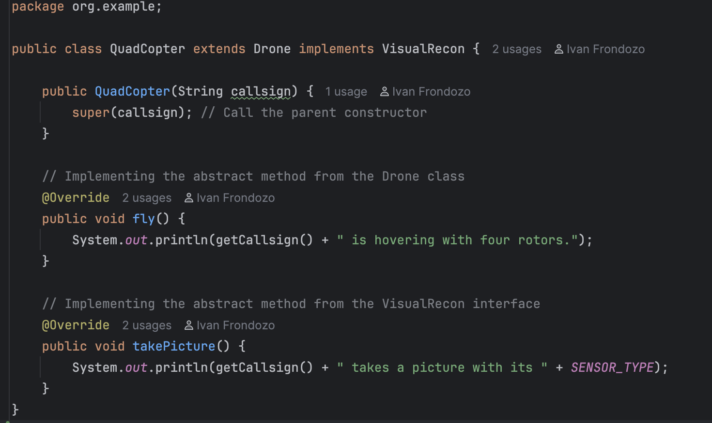
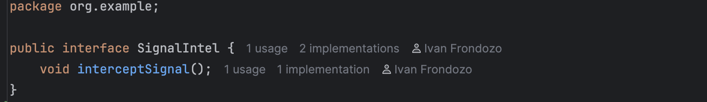
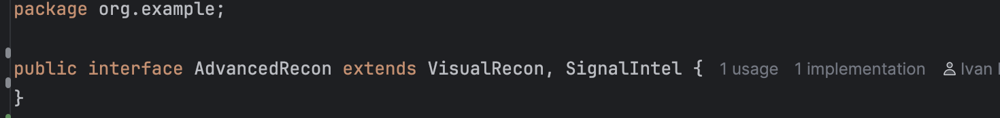
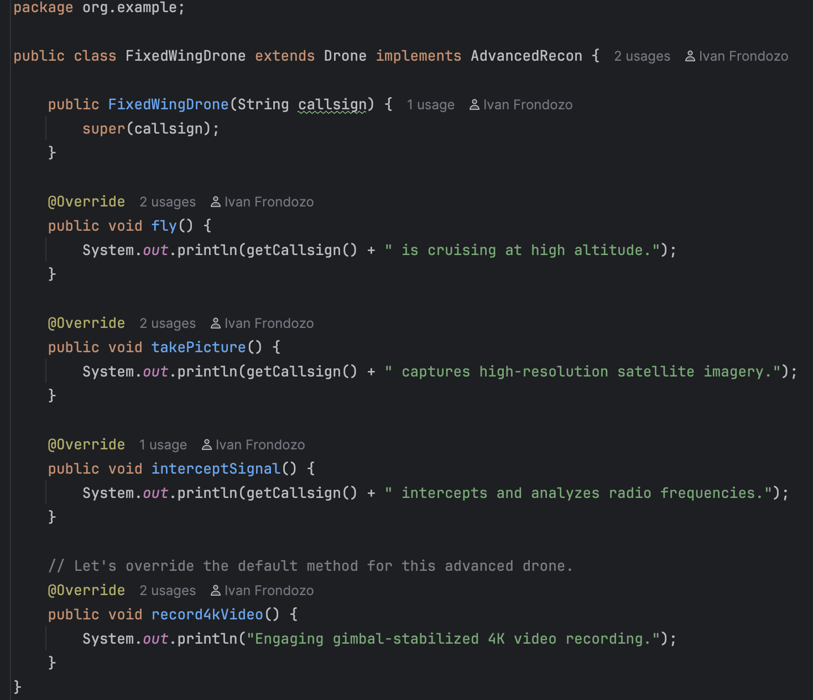

# Lab: Java Inheritance and Interfaces

### by: Ivan Patrick Frondozo

## Description:

This is a simple Java program aimed to practice creating inheritance and interface features to build a flexible and modular drone model system.

## Output:

### Mission Control: (main program)

### Drone: (abstract class)

### Visual Recon: (interface/capability package)

### Quad Copter: (first drone/implements drone)

### Signal Intel: (interface)

### Advanced Recon: (interface)

### Fixed Wing Drone: (another drone model)

